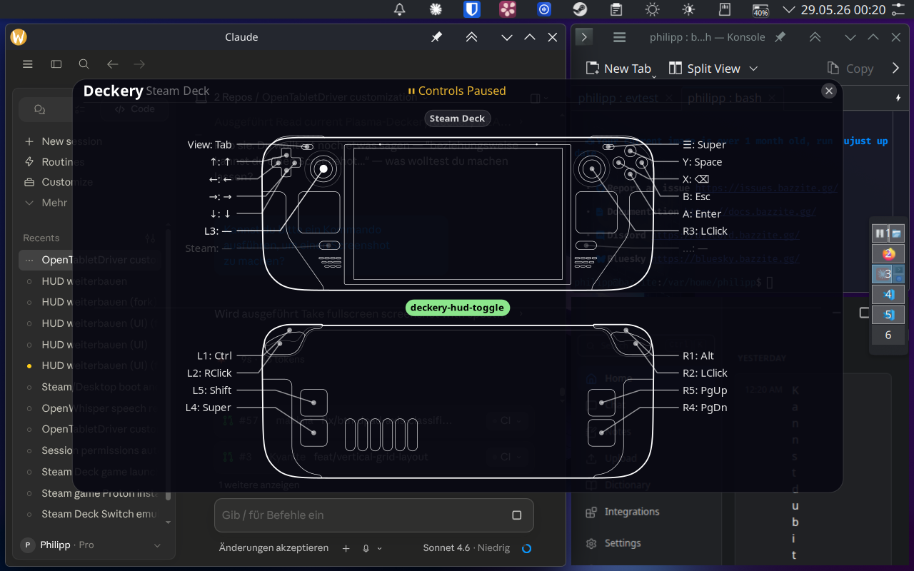

# deckery-hud

A Wayland overlay for the Steam Deck that shows what every button does right now. Part of [Plasma Deckery](https://github.com/Plasma-Deckery/deckery).

Hold a modifier and the full combo layer appears instantly. The idea is simple: controls should be discoverable and explain themselves — for easier onboarding and faster recall.



<video src="https://github.com/user-attachments/assets/728cf2dc-443e-446e-8714-4931174684ad" controls autoplay loop muted></video>

---

## What it does

- Renders two Steam Deck silhouettes (front + back) with callout lines to button labels
- Updates live from `/tmp/makima-state.json` — written atomically by [makima-deckery](https://github.com/Plasma-Deckery/makima-deckery) on every input event
- Pauses makima remapping while open (dry-run mode: see what buttons do without triggering anything)
- Center strip shows the active modifier state and the last emitted key event
- Dot colours: **amber** = modifier held, **white** = button active, **gray** = unbound
- Small amber dot on buttons that would unlock a combo if held next (discoverable modifiers)

---

## Architecture

```
makima-deckery ──► /tmp/makima-state.json
                           │
                    inotify (directory watch)
                           │
                      deckery-hud
                    (GTK4, Layer Shell)
                           │
               ┌───────────┴───────────┐
           renderer.py             makima IPC
         (SVG + Cairo/Pango)    pause on show
                                resume on hide
```

The HUD runs as a persistent D-Bus service (`de.plasma_deckery.hud`). The window starts hidden; Toggle/Show/Hide are called via D-Bus. The `/tmp/` directory is watched rather than the file itself because atomic rename (used by makima for safe writes) creates a new inode — a file watch would miss it.

---

## Setup

### Dependencies

Runs inside a [distrobox](https://github.com/containers/distrobox) container (`deckery`) because `gtk4-layer-shell` is not available as a GObject Typelib on the Bazzite host.

Required inside the container:
- Python 3
- `gtk4-layer-shell` (with GObject Typelib)
- `pygobject` (GTK4 bindings)
- `librsvg` (SVG rendering)
- `pango` / `pangocairo` (text layout)

### Scripts

Two scripts go to `~/.local/bin/` on the host:

**`deckery-hud`** — starts the service:
```bash
exec distrobox enter deckery -- bash -c \
  "LD_PRELOAD=/usr/lib/libgtk4-layer-shell.so python3 /home/philipp/Programming/deckery-hud/deckery-hud.py"
```

**`deckery-hud-toggle`** — toggles visibility via D-Bus:
```bash
gdbus call --session \
  --dest de.plasma_deckery.hud \
  --object-path /de/plasma_deckery/hud \
  --method de.plasma_deckery.hud.Toggle
```

### Systemd

```bash
systemctl --user enable --now deckery-hud.service
```

The service unit is in `systemd/deckery-hud.service`.

### Trigger

In your makima config, bind a button to the toggle script:
```toml
BTN_THUMBL = ["deckery-hud-toggle"]
```

---

## State format

The HUD reads `/tmp/makima-state.json`. See [STATE_SPEC.md](STATE_SPEC.md) for the full contract between makima-deckery and the HUD.
